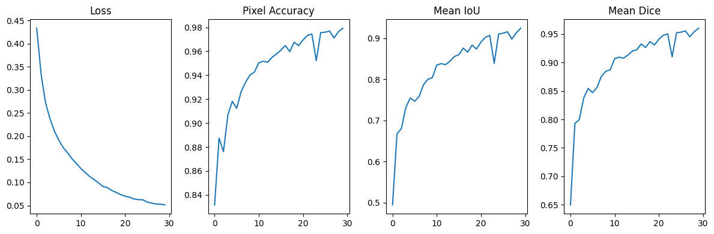
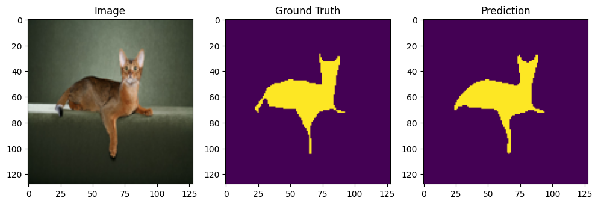

# UNet for Semantic Segmentation on OxfordPets (Mini Version)

## 📌 Overview
This project implements a **UNet** model for **semantic segmentation** using the **OxfordPets** dataset. The goal is to train a model that learns to identify and segment various object classes in natural images, such as Dogs and Cats.

## 📚 Background
**What is UNet**
**UNet** is a widely used architecture for semantic segmentation, originally developed for biomedical image segmentation. Its hallmark design involves:
    **Encoder (contracting path)**: captures high-level features through convolution and max-pooling.
    **Decoder (expanding path)**: uses transposed convolutions and skip connections to restore spatial resolution and produce dense predictions.

This structure allows the model to combine semantic context with spatial precision, making it ideal for pixel-wise tasks.

## 🧾 Dataset:  Oxford-IIIT Pet
**Description**
The Oxford-IIIT Pet Dataset, also known as OxfordPets, is a well-annotated dataset designed for image classification, object detection, and semantic segmentation of pets. It contains images of 37 pet breeds with high-quality pixel-wise annotations for each pet object.

- Total classes: 37 pet breeds (e.g., Persian cat, Beagle, German Shepherd)
- Annotations:
    - Classification labels (breed, species, and fur length)
    - Pixel-level segmentation masks:
        - Label 1: Pet
        - Label 2: Border (outline around pet)
        - Label 3: Background


**Directory Structure (Oxford-IIIT Pet)**
```
oxford-pets/
├── images/                    # Original pet images (.jpg)
├── masks/                     # Segmentation masks (labelled as 1, 2, 3)
```
Because configuration is required after download. we suggest to follow commands:
```
!wget https://www.robots.ox.ac.uk/~vgg/data/pets/data/images.tar.gz
!wget https://www.robots.ox.ac.uk/~vgg/data/pets/data/annotations.tar.gz
!tar -xvzf images.tar.gz
!tar -xvzf annotations.tar.gz

!mkdir -p data/OxfordPets/images
!mkdir -p data/OxfordPets/masks
!cp images/* data/OxfordPets/images/
!cp annotations/trimaps/* data/OxfordPets/masks/
```

## 📐 Task Adaptation
For this project, the dataset is adapted to a binary semantic segmentation task:
- Class 1 (Foreground): Pet (label == 1)
- Class 0 (Background): Everything else (labels 2 & 3 merged)

This simplification is practical for training models like UNet to detect pet shapes and boundaries effectively without worrying about breed-specific segmentation.

## 🏗️ Project Structure
```
├── data/                         #  Oxford-IIIT Pet dataset (VOC format)
├── models/
│   └── unet.py                   # UNet architecture implementation
├── train.py                      # Training and validation loop
├── utils.py                      # Data transforms, label maps, metrics
├── predict.py                    # Inference script to test on new images
├── requirements.txt              # Project dependencies
└── README.md                     # Project documentation
```

## 🔧 Installation
You can clone this project on local machine

## 🧪 Training the Model
```
python train.py --epochs 50 --batch_size 8 --lr 0.001
```
## 📏 Evaluation Metrics


## 🖼️ Sample Results
Here are some qualitative results showing how the UNet performs on the Oxford-IIIT Pet set:


## 📌 References
Dataset Home: https://www.robots.ox.ac.uk/~vgg/data/pets/
U-Net-Convolutional Networks for Biomedical Image Segmentation (https://arxiv.org/abs/1505.04597)